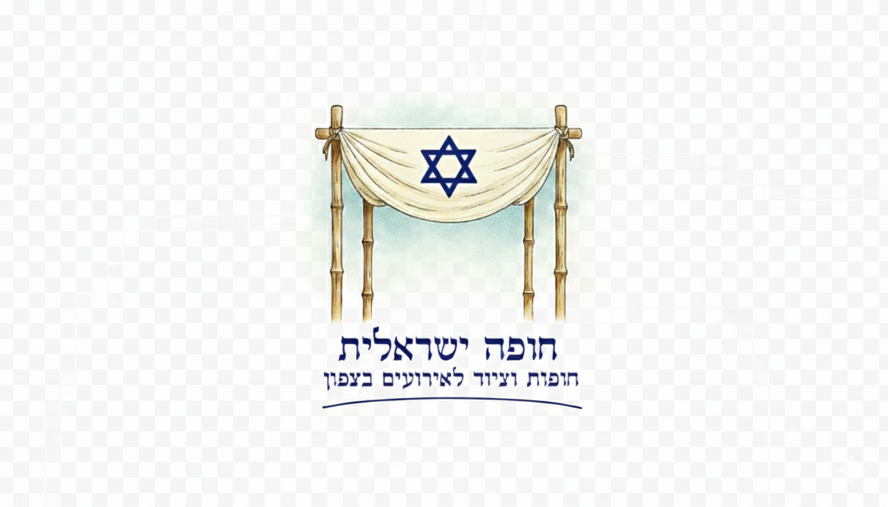

# README (עברית): עמוד נחיתה RTL – חופה ישראלית

ברוך הבא! זהו אתר נחיתה רספונסיבי, בעברית ובכיוון ימין־לשמאל (RTL), עם תפריט דביק, עוגנים, מוצר(ים), גלריה עם מסך מלא, המלצות, וטופס יצירת קשר (דמו).

התיקייה כוללת:
- `index.html` – קובץ האתר היחיד, מוכן לפתיחה בדפדפן.
- `assets/` – תיקייה ריקה לשמירת תמונות/לוגו שתרצה להוסיף.

---

## 📁 איך מפעילים מהר
1. לחץ פעמיים על `index.html` – האתר ייפתח בדפדפן.
2. עריכה: פתח את הקובץ בעורך טקסט (VS Code ממולץ).

---

## ✍️ איך משנים טקסטים
ב-`index.html` חפש/י את החלקים הרלוונטיים:
- **שם העסק והסלוגן** (סעיף “מי אנחנו”):
  ```html
  <h1 class="title">חופה ישראלית</h1>
  <p class="slogan">כאן יופיע הטקסט על העסק...</p>
  ```
  פשוט החלף את הטקסטים בין התגים.

- **תיאור קצר בכל חלק**:
  תראה הרבה אלמנטים עם המחלקה `section-desc`. החלף את הטקסט הפנימי.

- **טופס יצירת קשר** – שינוי טקסטים / תוויות:
  ```html
  <label for="f-name">שם</label>
  <label for="f-phone">נייד</label>
  <label for="f-date">תאריך מבוקש (אופציונלי)</label>
  ```

---

## 🖼️ איך מחליפים תמונות
בתוך `index.html` חפש/י `` והחלף לקובץ שלך:
```html

```
טיפ: שים את הקבצים שלך בתיקיית `assets/` ושנה את הנתיב בהתאם.

- לגלריות יש מבנה כמו:
```html
<div class="gallery" data-gallery="main">
  <figure></figure>
  ...
</div>
```
אפשר להחליף/להוסיף `<figure>...</figure>` כרצונך.

---

## 🟢 כפתור WhatsApp
לשינוי המספר של הכפתור הצף (תמיד משמאל־למטה) ושורת הקישור בתוך “יצירת קשר”:
```html
<a class="whatsapp" id="wa-float" href="https://wa.me/0000000000" ...>
```
החלף `0000000000` למספר שלך בפורמט בינלאומי (ללא +, לדוגמה: `972501234567`).  
הקישור הפנימי בטקסט מתעדכן אוטומטית בהתאם לקישור של הכפתור הצף.

---

## 🧩 הוספת מוצר חדש
שכפל את כרטיס המוצר הקיים (בקטע `#products`) ושנה מזהים/כותרות:
```html
<article class="product" aria-labelledby="prod2-title">
  <header>
    <h3 id="prod2-title">שם המוצר החדש</h3>
    <p class="section-desc">תיאור קצר...</p>
  </header>
  <figure>
    
  </figure>
  <div>
    <button class="btn" data-toggle="#prod2-details" aria-expanded="false" aria-controls="prod2-details">פרטים נוספים</button>
  </div>
  <div id="prod2-details" class="details" hidden>
    <div class="details-inner">
      <h4>מפרט ומידות</h4>
      <ul class="specs">
        <li>מידה א׳</li>
        <li>מידה ב׳</li>
      </ul>
      <h4>גלריה</h4>
      <div class="gallery" data-gallery="prod2">
        <figure></figure>
      </div>
    </div>
  </div>
</article>
```
שים לב:
- שנה את כל המופעים של `prod2` (כולל `aria-labelledby`, `id`, ו-`data-gallery`).

---

## 🧱 הוספת סקשן חדש
1. הוסף `<section id="my-section"> ... </section>` במקום המתאים ב-`<main>`.
2. הוסף קישור בתפריט העליון:
   ```html
   <a href="#my-section">שם הסקשן</a>
   ```
3. כדי שהגלילה תשב יפה מתחת לתפריט הדביק: אין צורך לשנות כלום – כל ה-`section` מקבלים `scroll-margin-top` בסקריפט.

דוגמה בסיסית לסקשן:
```html
<section id="faq">
  <div class="container">
    <div class="section-header">
      <h2>שאלות נפוצות</h2>
    </div>
    <p class="section-desc">כאן טקסט לדוגמה...</p>
  </div>
</section>
```

---

## 🎨 שינוי צבעים / פונט
לכל הצבעים יש משתנים בתחילת ה-CSS:
```css
:root{
  --brand:#1e88e5;
  --brand-2:#0d47a1;
  --accent:#ff8a00;
}
```
- החלף לערכים שלך (למשל HEX).  
- הפונט מוגדר ל-Heebo מ-Google Fonts. אפשר להחליף לקו״פונט/Assistant/Inter וכו׳.

---

## 🖥️ העלאה לאוויר (3 דרכים קלות)

### 1) Netlify (מומלץ למבנה הזה)
- היכנס ל- https://www.netlify.com
- לאחר הרשמה → Drag & Drop של **כל התיקייה** או ZIP.
- תקבל קישור `https://something.netlify.app`
- עדכון גרסה: מייצרים ZIP חדש/מעדכנים את הקובץ ומגררים שוב.

### 2) Vercel
- https://vercel.com → “Add New Project” → גרור את התיקייה/ZIP.
- תקבל כתובת `vercel.app`.
- עדכון = העלאה מחדש.

### 3) GitHub Pages
- צור repo ב-GitHub והעלה את `index.html`.
- בהגדרות → Pages → הפעלה מ-main/root.
- כתובת תראה כמו `https://username.github.io/reponame/`.

---

## 🔧 חיבור טופס אמיתי (אופציונלי)
כרגע הטופס מציג alert דמו. אם תרצה לשלוח מיילים בפועל:
- שירותים קלים: Netlify Forms / Formspree / Getform.  
- או לכתוב endpoint קטן (Serverless) ב-Vercel/Netlify שיקבל POST וישלח מייל.

---

## 📐 תמיכה RTL ושיקולים
- לכל הדף `dir="rtl"` + `lang="he"`.  
- התפריט דביק, הגלילה חלקה, והעוגנים מודגשים.  
- איקונים/חיצים/כיווניות בגלריה הותאמו (prev/next).

---

## ❓ שאלות נפוצות
- **למה הגלילה לא נעצרת נכון מתחת לתפריט?**  
  לכל `section` יש `scroll-margin-top: 90px` בתסריט. אם תשנה גובה תפריט – עדכן את הערך.
- **איך מחליפים את שם האתר בטאב הדפדפן?**  
  תג `<title>...` בראש העמוד.
- **איך מוסיפים פאביקון?**  
  הוסף בקובץ `<head>`:
  ```html
  <link rel="icon" href="assets/favicon.ico">
  ```

בהצלחה! ✨
